# Context Diagram (C4 Level 1)

## Purpose

This document defines the system boundary for Tiber and identifies the external actors and systems that interact with it.

It provides a high-level architectural view of the platform without exposing internal implementation details such as databases, message brokers, services, or deployment topology.

The context diagram serves as the foundation for subsequent architecture documents by establishing what belongs inside Tiber and what exists outside its boundary.

## Diagram

## Interaction Summary

Client applications submit notification requests to Tiber through its public APIs.

Tiber processes these requests, optionally enriches the notification content using external AI providers, and routes notifications through one or more external delivery providers.

Notification providers deliver messages to end users across supported channels.

System administrators interact with Tiber to configure, monitor, and troubleshoot the platform, while monitoring systems collect operational metrics and health information exposed by Tiber.

Application developers integrate their software with Tiber but do not interact directly with downstream notification providers.

## Assumptions

- External providers may become unavailable.
- AI services are optional enhancements.
- Client applications authenticate before using Tiber APIs.
- Delivery providers are replaceable.
- End users never interact directly with Tiber APIs.
