# Container Diagram (C4 Level 2)

## Purpose

This document decomposes Tiber into its primary deployable containers and illustrates how they collaborate to deliver notification requests.

Unlike the Context Diagram, which models Tiber as a single system, this document exposes the major runtime building blocks while intentionally omitting internal implementation details such as classes, packages, and algorithms.

## Architectural Style

Tiber adopts a Modular Monolith architecture combined with asynchronous event-driven processing.

Synchronous API requests handle ingestion, authentication, validation, and user-facing operations.

Long-running and fault-tolerant work such as notification delivery, scheduling, AI content enhancement, and machine learning inference is executed asynchronously through background workers.

This approach provides a clear separation between request processing and asynchronous workloads while avoiding the operational complexity of microservices.

## Diagram

## Interaction Summary

1. A client submits a notification request through the API.
2. The API validates and persists the request a database.
3. The API publishes a delivery job to RabbitMQ.
4. A worker consumes the job asynchronously.
5. The worker loads the notification state from database
6. The worker requests ML predictions when required.
7. The worker enhances notification content through the AI Gateway when enabled.
8. The worker selects a delivery provider.
9. Delivery results are persisted.
10. The frontend retrieves notification status through the API.

## Design Rationale

The platform intentionally separates synchronous request handling from asynchronous notification processing.

This keeps API response times low while enabling retries, scheduling, provider failover, and AI/ML enrichment without blocking client requests.

Machine learning and LLM interactions are isolated behind dedicated containers to maintain clear architectural boundaries. Although these containers are initially deployed alongside the worker service, their separation in the architecture allows future extraction into independent services without changing higher-level workflows.

RabbitMQ is selected as the messaging backbone because it exposes routing, durability, acknowledgements, and dead-letter semantics that closely match the platform's notification-processing requirements.
