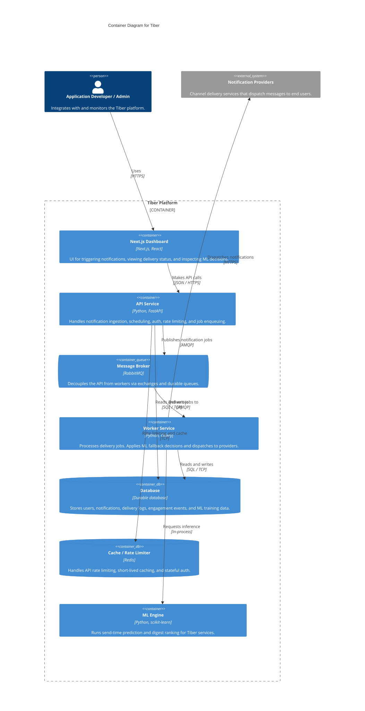

# Container Diagram

**C4 Level:** 2. Containers

**Container in focus:** N/A

## Purpose

This diagram shows the internal containers that make up the Tiber platform; The deployable units, their technology choices, and how they communicate with each other and with external systems. It is intended for engineers and technical reviewers who need to understand the high-level architecture before working on any individual container. It does not show internal component structure; that is the concern of the Level 3 diagrams for the API Service, Worker Service, and ML Engine.

## Diagram

## Key Decisions

- **RabbitMQ as the message broker over Redis:** Celery supports both Redis and RabbitMQ as brokers. RabbitMQ was chosen deliberately because it exposes exchange types, routing keys, and queue durability as first-class concepts rather than abstracting them away. This means the messaging topology, which exchange a notification job is published to, which routing key determines its queue, how dead-letter queues are bound, is explicit and engineered, not inherited from framework defaults. The tradeoff is operational complexity: RabbitMQ requires a separate hosted instance (e.g CloudAMQP free tier for deployment) whereas Redis would have doubled as both broker and cache with a single instance.

- **Redis retained alongside RabbitMQ with three distinct roles:** With RabbitMQ handling brokering, Redis serves as the auth state store (JWT blocklist, API key revocation list), rate limiting counter store, and idempotency key cache. These are genuinely different data with different TTLs and access patterns, but they share a single Redis instance for operational simplicity at this scale. Redis is a hard dependency for auth. If it is unreachable, the API Service fails closed with a 503 rather than allowing requests through with unverifiable revocation state.

- **The ML Engine is an in-process boundary, not a standalone service:** The ML Engine is packaged as a Python module used by the API Service at intake time for send-time and digest-ranking predictions. The Worker Service can use the same boundary only for fallback or revalidation when prediction metadata is missing or stale. Content generation is not a Tiber service at all: the authorship constitution (below) forbids AI-altered content in the delivery path. Keeping the ML boundary in-process avoids extra services to host, health-check, or version independently while preserving interfaces that could later be extracted behind HTTP APIs without changing callers.

- **Decisions and authorship are separated by a constitution, not just a container:** The ML Engine makes decisions — when to send, how to order batched digests — using trained scikit-learn models. It never authors: client content is delivered verbatim, invalid content is rejected with a clear error rather than silently completed, and CRITICAL notifications are unconditionally excluded from any generative surface. This separation exists because the two have different failure modes (a bad prediction costs an open rate; a bad rewrite costs the client's brand, or turns a password reset into a phishing-shaped artifact).

- **Provider abstraction with selective live integration:** The Worker Service dispatches to a provider abstraction layer that supports all channels (email, push, SMS, in-app) through a common interface. Email and push are fully implemented with live provider integrations. SMS and in-app are implemented as documented mock adapters that satisfy the same interface. This is a deliberate scope decision. The abstraction proves extensibility without requiring live integrations. The decision is architecturally visible here because all providers appear as a single external system, not separate ones.

- **A durable database is the single source of truth for domain state:** Projects, API keys, templates, recipients, notifications, delivery attempts, engagement events, delivery constraints, blackout dates, restricted windows, webhook registrations, webhook events, model version metadata, and training run metadata all live in a durable database. Redis holds only ephemeral state with defined TTLs. This means Redis can be flushed or replaced without data loss, only active sessions, in-flight rate limit windows, revocation cache entries, and recent idempotency keys are affected.

- **Object storage holds model artifacts and derived training datasets:** The ML Engine stores trained model artifacts and materialized training datasets in S3-compatible object storage (S3 in hosted environments, MinIO locally). The durable database stores the authoritative metadata and source events; object storage stores large derived artifacts that need independent persistence, inspection, and rollback.

## What This Diagram Does Not Show

This diagram does not show the internal structure of any container consisting of components, business capabilities, or code organisation are covered in the Level 3 diagrams. It does not show the RabbitMQ exchange and queue topology (exchanges, routing keys, dead-letter bindings).
