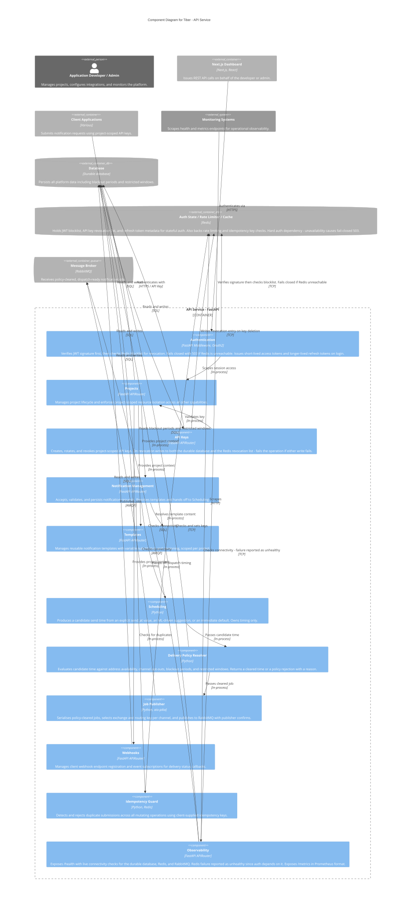

# API Service Component Diagram

**C4 Level:** 3. Components

**Container in focus:** API Service (FastAPI)

## Purpose

This diagram shows the business capabilities that make up the Tiber API Service and the dependencies between them. It is intended for engineers working on or reviewing the API Service who need to understand how responsibility is divided internally before reading or writing code. Each component represents a distinct, nameable capability, not a class, module, or framework concept. The diagram answers the question: what does the API Service actually do, and what is the boundary between each of those things?

## Diagram

## Key Decisions

- **Authentication performs two checks in a defined order:** Signature verification happens first because it is stateless and requires no I/O. A token with an invalid signature is rejected immediately without touching Redis. Only after the signature is confirmed valid does the Authentication component check the Redis blocklist for revocation. This order matters for performance and availability: a malformed or expired token never causes a Redis read, which means token abuse patterns cannot be used to amplify Redis load. If Redis is unreachable, the component fails closed with a 503, it does not fall back to signature-only validation.

- **API key revocation requires a dual write to the durable database and Redis, and fails if either fails:** Marking a key inactive in the database alone is insufficient, the key would remain in the Redis blocklist TTL window as unknown and therefore potentially usable. Writing to Redis alone means the revocation has no permanent record and is lost on a Redis flush. Both writes are required atomically from the caller's perspective: if the Redis write fails after the database write succeeds, the operation returns an error and the database write is rolled back. This is stricter than eventual consistency but necessary given the security implications of revocation.

- **Projects is a scope enforcer, not just a CRUD endpoint:** Every other capability, i.e Notification Management, Templates, Webhooks, API Keys receives project context from the Projects component before performing any operation. This means project membership and access validation are resolved once, consistently, at the Projects layer rather than being re-implemented inside each capability. In practice this is implemented as a FastAPI dependency (`get_current_project`) injected into every protected route, which resolves the project from the authenticated session or API key and makes it available downstream without each route needing to query it independently.

- **ML Engine attaches Predictions:** The API service calls the ML Engine for prediction metadata that it attaches to the job payload before it is published to the broker. The worker service may further re-evaluate that metadata if required.

- **Scheduling and the Delivery Policy Resolver are separated into distinct components:** Scheduling produces a candidate send time, from an explicit `send_at`, an ML suggestion, or an immediate default. It does not know about recipient opt-outs, address availability, blackout periods, or restricted windows. The Policy Resolver owns all constraint evaluation against the candidate time and returns one of two outcomes: cleared (dispatch as scheduled) or rejected (a policy violation with a recorded reason). Separating these means adding a new constraint — a blackout period, a restricted window, a recipient-level check — requires a change only to the Policy Resolver, with no impact on the Scheduling component or the Job Publisher.

- **The Delivery Policy Resolver evaluates four constraint types in a fixed order:** Two read recipient state from the `Recipient` aggregate: channel address availability first, and channel opt-outs second which are both hard constraints, and a violation at either rejects the notification outright. Two read project-wide configuration from the `DeliveryConstraint` aggregate: blackout periods third, and restricted windows last. All four constraints are hard: a violation at any of them rejects the notification outright and never reschedules it. Restricted windows are prohibitions composed additively, i.e, a time is deliverable only when it falls inside none of the channel's windows, so each registered restriction narrows the deliverable set. Both time-based constraints are evaluated in the project's timezone which is an IANA name stored on the constraint. CRITICAL notifications bypass both time-based rules, blackout periods and restricted windows, on the same grounds as the preference bypass: the recipient's need to receive the message outranks the project's configured silence.

- **The Job Publisher is a distinct component from Scheduling:** After the Policy Resolver clears a job, the Job Publisher handles the mechanics of getting it onto RabbitMQ — serialisation, exchange selection, routing key assignment per channel, and publisher confirms. Separating this from Scheduling means the Scheduling component has no knowledge of the broker, its exchange topology, or its routing semantics. It hands a plain dispatch-ready job object to the Policy Resolver chain, and the Job Publisher translates that into a broker-specific operation. This makes the broker swappable without touching Scheduling or Policy Resolver logic.

- **Idempotency Guard is checked before template resolution and scheduling:** The earliest possible rejection of a duplicate is the cheapest. Checking idempotency before resolving templates avoids a durable database read for the template content, and before scheduling avoids an ML inference call. The Guard stores the idempotency key in Redis with a 24-hour TTL on first submission and returns the original persisted response on any subsequent submission with the same key within that window. A duplicate does not return a 409 — it returns the original 201 response, making retries safe for clients without requiring them to distinguish between a first submission and a retry.

- **Delivery policy is enforced at two points: fully at intake, partially at dispatch:** The API Service enforces it fully at intake time via the Policy Resolver — the complete chain of address availability, opt-outs, blackout periods, and restricted windows — giving the caller fast feedback and keeping unnecessary jobs off the queue. The Worker Service re-runs a reduced chain at actual dispatch time, just before the provider is called: the same rule objects the intake resolver uses, minus the address rule. The address rule is deliberately excluded: an address cannot usefully drift, because the send itself resolves the address from the freshly loaded recipient. On guard failure the outcome is uniform: every constraint in the chain is hard, so the notification is marked policy_rejected with the rule's reason recorded, and no delivery attempt is made.

- **Webhooks in the API Service owns registration only, not firing:** Client applications register their webhook endpoint URLs and subscribe to specific delivery events (delivered, failed, bounced) through this component. The actual dispatch of webhook callbacks when those events occur happens in the Worker Service, which queries the registered endpoints from the durable database at delivery time. Both containers read the same webhooks table in the durable database — the API Service writes to it, the Worker reads from it. This is a deliberate boundary: the API Service should not know about delivery outcomes, and the Worker Service should not own endpoint management.

- **Observability treats Redis unavailability as unhealthy, not degraded:** Most health check implementations distinguish between unhealthy (the service cannot function) and degraded (the service is functioning with reduced capability). For Tiber, Redis unavailability is not a degraded state. It is an unhealthy state because the Authentication component fails closed when Redis is unreachable. A load balancer or deployment platform reading the `/health` endpoint needs to know that Redis down means the API Service is effectively down for authenticated requests. Reporting it as degraded would mask a full outage.

## What This Diagram Does Not Show

This diagram does not show internal class or function structure within any component — that is Level 4 detail and is not diagrammed. It does not show the Worker Service internals, which are covered in the Level 3 Worker Service component diagram.
