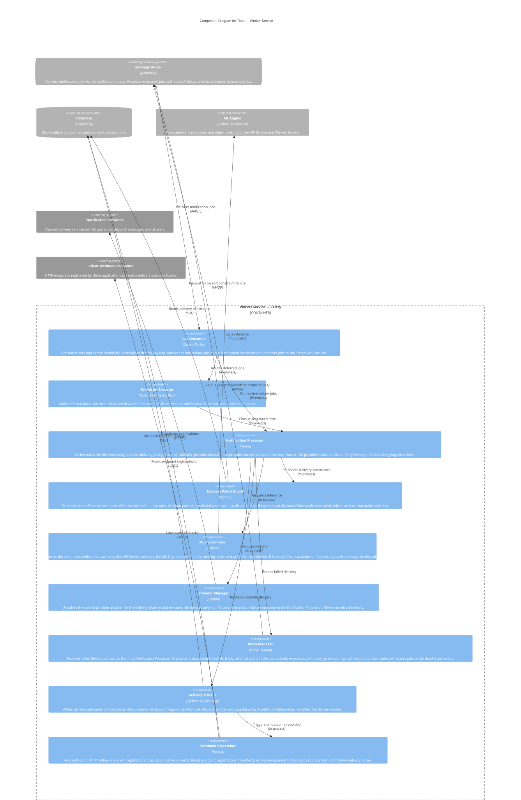

# Worker Service Component Diagram

**C4 Level:** 3. Components

**Container in focus:** Worker Service (Celery)

## Purpose

This diagram shows the business capabilities that make up the Tiber Worker Service and the dependencies between them. It is intended for engineers working on or reviewing the asynchronous delivery pipeline who need to understand how a notification job moves from the message queue to a delivered or dead-lettered outcome. The pipeline orchestrator is the Notification Processor, which sequences the worker components responsible for scheduling, policy enforcement, provider execution, retry handling, and delivery tracking.

The Worker Service owns one concern end to end: consume a job, process it through the pipeline, record the outcome, and notify the client. It does not own notification intake, initial scheduling decisions, or ML training data collection. Those belong to the API Service and ML Engine respectively.

## Diagram



## Key Decisions

- **Thin payload with pre-resolved stable fields:** Three approaches were considered for what a notification job carries on the queue. A notification ID only (fetch everything from Postgres at processing time) would cause read amplification under load and couple Worker throughput to Postgres read capacity. A full payload carrying all data including opt-outs and delivery constraints would be self-contained but stale, i.e if the recipient opts out or a constraint changes between enqueue and delivery, the Worker acts on outdated state. The chosen approach is a middle path: the payload carries fields that are stable and expensive to recompute at dispatch time (rendered content, recipient identifiers) and omits fields that can drift (channel opt-outs, blackout periods, delivery windows). The Dispatch Policy Guard re-reads the recipient from Postgres at dispatch time — a read the send requires anyway — alongside the project's delivery constraints, which is the minimal read necessary to guarantee freshness. Retry state, which are attempt count and max attempts, lives in the payload itself rather than in a separate Postgres table, meaning job state is self-contained and survives worker restarts without a database lookup.

```json
{
  "metadata": {
    "notification_id": "uuid",
    "project_id": "uuid",
    "idempotency_key": "client-generated-key",
    "correlation_id": "uuid",
    "schema_version": 1,
    "enqueued_at": "2026-01-01T08:45:00Z"
  },
  "delivery": {
    "channel": "email",
    "recipient": {
      "email": "user@example.com"
    }
  },
  "content": {
    "subject": "Your order has shipped",
    "body": "Hi Pascal, your order #1234 is on its way."
  },
  "scheduling": {
    "scheduled_time": "2026-01-01T09:00:00Z",
    "send_time_basis": "ml_predicted"
  },
  "intelligence": {
    "priority": "high",
    "channel_preference": "email",
    "model_versions": {
      "priority_classifier": "priority-2026-01-01.1",
      "send_time_optimizer": "send-time-2026-01-01.1",
      "channel_preference_predictor": "channel-2026-01-01.1"
    },
    "confidence": {
      "priority": 0.91,
      "send_time": 0.74,
      "channel_preference": 0.82
    }
  },
  "retry": {
    "attempt": 1,
    "max_attempts": 3
  }
}
```

- **Notification Processor is a pure orchestrator, all branching logic lives here:** The Notification Processor calls every other pipeline component in sequence but owns no delivery logic, retry logic, or outcome recording logic itself. This is an intentional design rule, not just a description. The consequence of the rule is that the Notification Processor is the only component that makes routing decisions: on provider success it routes to the Delivery Tracker; on provider failure it routes to the Retry Manager; on policy guard rejection it stops the pipeline and records a policy violation. If business logic ever accumulates in the Notification Processor beyond routing, it belongs in one of the components it calls. This keeps every component in the pipeline independently testable — the Notification Processor can be tested with mock implementations of every component it calls, and each component can be tested in complete isolation.

- **Provider Manager returns an outcome, it makes no retry decisions:** The Provider Manager resolves the correct channel adapter, executes the delivery attempt, and returns a typed success or failure result to the Notification Processor. Whether a failure warrants a retry, a dead-letter, or a policy violation record is a pipeline-level decision that belongs in the Notification Processor, not in the executor that detected the failure. This keeps the Provider Manager's responsibility precisely bounded: attempt delivery, report the result. Swapping or adding a provider adapter requires no knowledge of retry policy, and changes to retry policy require no changes to the Provider Manager.

- **Retry state is carried in the job payload, not stored in Postgres:** The Retry Manager increments the `attempt` field in the job payload and re-queues the modified payload with a backoff delay. No separate retry state table exists in Postgres. This means retry tracking is self-contained in the message — a worker restart, a broker failover, or a deployment during active retries does not lose retry history because the state travels with the job. The tradeoff is that retry history is not queryable from Postgres during a retry cycle. On terminal failure (attempt count exceeds max attempts), the Retry Manager routes the job to the dead-letter queue and the Delivery Tracker writes a failed outcome record to Postgres, which becomes the permanent and queryable record of the failure.

- **Dispatch Policy Guard re-runs the drift-sensitive subset of the intake chain:** The API Service Delivery Policy Resolver performs full constraint evaluation at intake time — address availability, opt-outs, blackout periods, delivery windows. The Worker's Dispatch Policy Guard re-runs that chain minus the address rule, built from the same rule objects so the shared rules cannot drift apart in behavior. It does not re-run scheduling, ML send-time confirmation, or template rendering; those sit outside the policy chain. The reduction follows the guard's purpose: re-check only inputs that can change between enqueue and delivery. Recipient state drift: an opt-out made after enqueue is invisible to intake, and since the Worker re-reads the recipient from Postgres for the send regardless, re-checking costs no additional I/O. Time drift: queue backlog and retry backoff mean actual dispatch can land far from the candidate time intake evaluated, so time-based constraints are judged against the real dispatch moment. The address rule is excluded because an address cannot usefully drift: the send resolves the address from the freshly loaded recipient, so a missing address surfaces as a delivery failure with a recorded attempt, not a policy rejection. On soft constraint failure (blackout period active) the job is re-queued to run after the blackout ends. On hard constraint failure (delivery window, channel opt-out) it stops the pipeline, logs the violation with a reason, and records the outcome as policy-rejected in Postgres.

- **Delivery Tracker writes before Webhook Dispatcher fires:** The Delivery Tracker writes the outcome to Postgres as the authoritative record before triggering the Webhook Dispatcher. If the Webhook Dispatcher fails, i.e the client endpoint is unreachable, returns a non-2xx response, or exhausts its own retry budget, then the delivery record in Postgres is unaffected. The notification is considered delivered regardless of whether the client received the webhook callback. This ordering matters: a webhook is a notification of an outcome, not the outcome itself. The Webhook Dispatcher maintains its own independent retry logic with a separate backoff policy and a separate dead-letter path for exhausted webhook deliveries.

- **ML and AI coordinators degrade gracefully and never block delivery:** The API Service normally attaches ML prediction metadata before a job is published. At dispatch time, the Worker ML Coordinator consumes that metadata and only calls the ML Engine if prediction data is missing, stale, or explicitly marked for revalidation. If that fallback call fails, it uses defaults (medium priority, existing scheduled time, no channel override) and logs the degradation. If the AI Gateway is unavailable, the AI Coordinator uses the original notification content as-is and logs the degradation. In both cases the pipeline continues without interruption. This implements the principle that AI and ML are enhancements to delivery, not dependencies for it. A platform that cannot send a plain notification because a model or LLM provider is unreachable is not production-grade.

- **Engagement Tracker belongs to the ML Engine, not the Worker Service:** Provider engagement events (opens, clicks, bounces, unsubscribes) arrive at the API Service as inbound provider webhooks, are validated and enqueued, and are consumed by the Engagement Tracker in the ML Engine container. Placing the Engagement Tracker in the Worker Service would conflate two unrelated concerns, i.e delivery pipeline processing and ML training data collection in the same container. The Worker Service's responsibility ends when a notification is delivered and its outcome is recorded. What the ML training pipeline does with that outcome afterwards is the ML Engine's concern.

## What This Diagram Does Not Show

This diagram does not show internal class or function structure within any component. The provider adapter interface and the specific adapters (email, push, mock adapters for SMS and in-app) are implementation details visible at the code level, not at this diagram's level of abstraction. The ML Engine's internal structure including the Engagement Tracker, training pipeline, and inference interface 