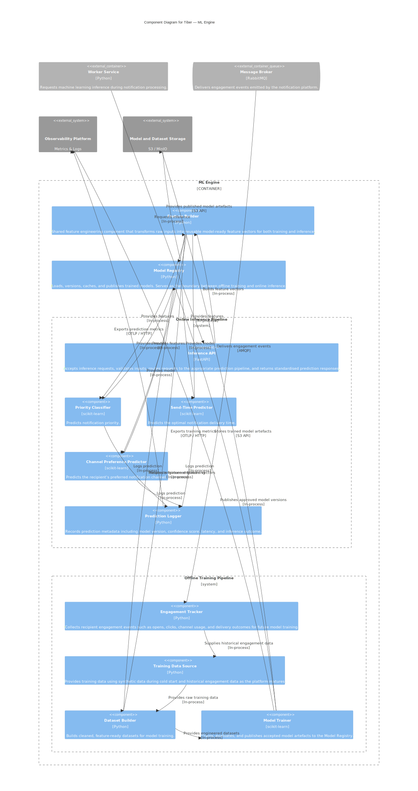

# ML Engine Component Diagram

**C4 Level:** 3. Components

**Container in focus:** ML Engine

## Purpose

This diagram decomposes the ML Engine into its internal components and illustrates how machine learning capabilities are organised within Tiber. It identifies the responsibilities of each component, the separation between the online inference and offline training pipelines, and the interactions between shared infrastructure such as feature engineering, model management, prediction logging, and model storage.
The diagram demonstrates how the ML Engine separates prediction serving from model training while sharing common components to ensure training-serving consistency and a well-defined model lifecycle.

## Diagram

## Key decisions

- **Separate online inference from offline training:** The ML Engine is divided into two independent pipelines: **Online Inference Pipeline** responsible for serving low-latency predictions to the Worker Service and **Offline Training Pipeline** responsible for preparing datasets, training models, and publishing new model versions. Separating these concerns allows inference to remain lightweight and predictable while enabling training to evolve independently without affecting production request latency.

- **Feature engineering is shared:** Feature engineering is centralized within the Feature Builder, which is shared by both the online inference and offline training pipelines. Using the same feature engineering logic for training and inference guarantees training-serving consistency and prevents discrepancies caused by duplicate feature implementations.

- **One predictor per prediction task:** Each prediction capability is implemented as an independent component. Priority Classifier predicts notification priority. Send-Time Predictor recommends an optimal delivery time. Channel Preference Predictor predicts the recipient's preferred delivery channel. Each predictor owns a single responsibility and can evolve independently without affecting the others.

- **The Model Registry separates training from inference:** The Model Registry acts as the contract between the offline training and online inference pipelines. The Model Trainer publishes approved model versions to the registry, while inference components load models exclusively through the registry. This decouples model production from model serving and allows models to be updated without changing inference components.

- **Training begins with synthetic data:** Tiber initially has no historical engagement data. To overcome this cold-start problem, the Training Data Source generates synthetic engagement data during early development. As the platform accumulates real user interactions through the Engagement Tracker, the same component transitions to supplying historical engagement data without requiring changes to the surrounding training pipeline.

- **Model artefacts are externally stored:** Trained models and training datasets are stored in external object storage. The Model Registry retrieves published model artefacts from storage for use during inference, allowing models to persist independently of the running ML Engine and enabling future integration with cloud-native storage solutions.

- **The inference pipeline remains stateless:** The online inference pipeline does not access PostgreSQL or other application databases. All information required for prediction is supplied by the Worker Service as part of the inference request. This keeps inference horizontally scalable and minimizes coupling with the rest of the platform.

- **Predictions and training are observable:** Every inference is recorded by the Prediction Logger, including prediction result, confidence score, model version, inference latency, timestamp. Similarly, the training pipeline exports training metrics for operational monitoring and future model evaluation. This provides end-to-end visibility into both model serving and model development.

## What this diagram does not show

This component diagram focuses on the internal organisation of the ML Engine.

It intentionally omits implementation details.
