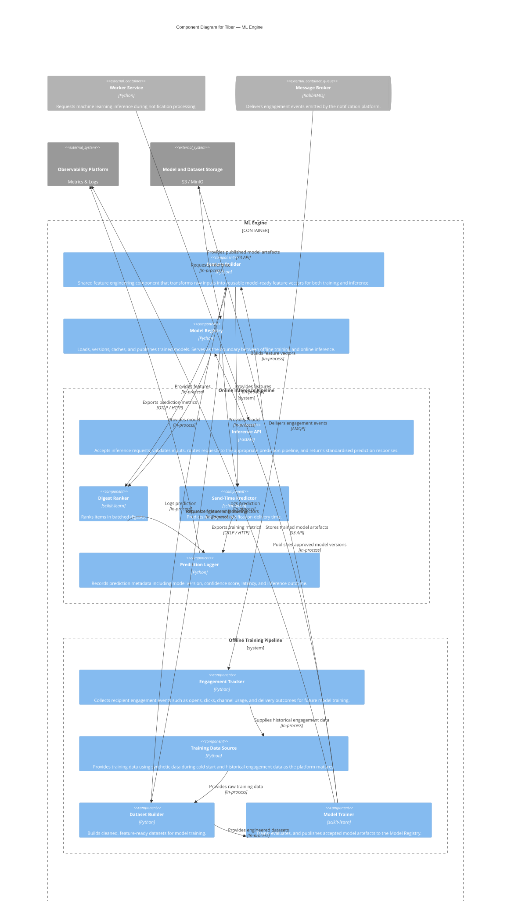

# ML Engine Component Diagram

**C4 Level:** 3. Components

**Container in focus:** ML Engine

## Purpose

This diagram decomposes the ML Engine into its internal components and illustrates how machine learning capabilities are organised within Tiber. It identifies the responsibilities of each component, the separation between the online inference and offline training pipelines, and the interactions between shared infrastructure such as feature engineering, model management, prediction logging, and model storage.
The diagram demonstrates how the ML Engine separates prediction serving from model training while sharing common components to ensure training-serving consistency and a well-defined model lifecycle.

## Diagram

## Key Decisions

- **Online inference and offline training are separated into independent pipelines:** The ML Engine is divided into two pipelines with distinct operational characteristics. The Online Inference Pipeline serves low-latency predictions to the API Service synchronously during notification intake, and to the Worker Service only for fallback or revalidation. The Offline Training Pipeline prepares datasets, trains models, and publishes new versions asynchronously and independently of live traffic. Separating these concerns means inference latency is never affected by a training run, training datasets can grow and be reprocessed without touching inference code, and each pipeline can be monitored, debugged, and evolved independently.

- **Feature engineering is shared between both pipelines via the Feature Builder:** Feature engineering logic, namely, encoding channel history, normalising timestamps to user timezone, computing content-length signals, encoding notification type, is centralised in a single Feature Builder component used by both the Inference API at serving time and the Dataset Builder at training time. This is the primary defence against training-serving skew: the condition where a model is trained on features shaped one way and served predictions on features shaped a different way, producing silently degraded accuracy. With a shared Feature Builder, any change to feature engineering applies to both pipelines simultaneously. A duplicate implementation in training and inference is not just redundant, it is a latent bug.

- **One predictor per prediction task:** Send-time prediction and digest ranking are implemented as independent scikit-learn components rather than a single multi-output model. The alternative, which is a single model predicting all outputs simultaneously, would couple their training data requirements, evaluation cycles, and model promotion decisions into one artifact. In practice this means: if send-time prediction accuracy degrades and requires retraining on new engagement data, only the Send-Time Predictor is retrained and promoted. The Digest Ranker is unaffected. Independent models can be versioned, evaluated, and replaced independently. A multi-output model ties all of them to the same training run and the same promotion decision. The long-term target shape is one engagement-probability core with decision-specific heads — send-time, ranking, and the deferred decision features are all functions of P(engage) — and independent components remain the right implementation until accumulated data volume justifies shared representations.

- **Decisions only — the authorship constitution:** The ML Engine decides when to send (Send-Time Predictor) and in what order digest items appear (Digest Ranker). It never authors: notification content is delivered verbatim, and no ML component in this engine reads content in order to change it. The only content-adjacent signal used is structural (length, category encoding) for feature engineering — content is consumed as features, never produced as text. Tiber integrates no LLM anywhere; see the container diagram for the authorship boundary rationale. The digest assembly design itself — group-key collapse, ranking, per-item tracked links, and the open member-status fork — is recorded in the send-contract decision record (doc 08).

- **Predicted send times carry provenance as domain state:** The domain entity stores `send_time_basis` (EXPLICIT / IMMEDIATE / ML_PREDICTED) alongside the send time itself, so `(send_at = T, basis = ML_PREDICTED)` is a first-class state — Tiber scheduled it, the client did not. The prediction lands through the entity's guarded `schedule()` transition (legal only from ML_PREDICTED while PENDING; re-prediction allowed until dispatch; client-owned EXPLICIT schedules are untouchable). Provenance must survive database round-trips as stored state rather than being re-derived, because measured predictor lift — predicted time vs actual engagement — is the only honest evaluation of this feature.

- **The Model Registry is the boundary between training and inference:** The Model Registry acts as the explicit contract between the offline training and online inference pipelines. The Model Trainer publishes approved model versions to the registry after passing evaluation thresholds; inference components load models exclusively through the registry. This means models can be updated, rolled back, or promoted without changing any inference code. The registry also caches loaded model artifacts in memory, meaning disk or network reads occur only on version changes rather than on every inference request.

- **Model promotion is a deliberate step, not an automatic one:** The Model Trainer evaluates candidate models against a baseline and a minimum performance floor before publishing. A model that passes evaluation is written to object storage and its version registered in the Model Registry. It does not become the active serving model until it is explicitly promoted. This prevents a regression in training data quality or a poorly configured training run from silently replacing a production model. The promotion step is a checkpoint, not a formality.

- **Training begins with synthetic data and transitions without pipeline changes:** Tiber initially has no historical engagement data. The Training Data Source generates synthetic engagement data (realistic user personas with configurable engagement patterns and noise) during early development and model bootstrapping. As the platform accumulates real user interactions through the Engagement Tracker, the Training Data Source transitions to supplying historical engagement data. This transition requires no changes to the Dataset Builder, Model Trainer, or any other training pipeline component. The Training Data Source is the single point of change, and the `is_synthetic` flag on every training record ensures real and synthetic data are never silently mixed in the same training run.

- **Model artefacts are stored externally in object storage:** Trained models and training datasets are stored in S3-compatible object storage (S3 or MinIO for local development). The Model Registry retrieves published artefacts from storage at startup or on version change rather than holding them in application memory permanently. This means model artefacts persist independently of the running ML Engine process, survive restarts and redeployments without data loss, and can be inspected, downloaded, or rolled back directly from storage without touching the application.

- **The online inference pipeline is stateless:** The inference pipeline does not read from the durable database or any other application database. All information required for a prediction is supplied by the calling service as part of the inference request: notification facts (channel, category, topic, group key), recipient profile facts (timezone, language — set once by the client per doc 08, D1), and engagement aggregates (the caller computes history features from its own database; the ML Engine never queries it). The per-send `context` payload was retired — profile facts replaced it (doc 08, D5). Where a future feature seems to require the ML Engine to look up data itself, that is a signal to widen the request contract, not to break statelessness. This keeps each inference call self-contained, makes the inference pipeline independently testable without a database, and means the inference pipeline can scale horizontally without introducing distributed state management.

- **Predictions and training runs are both observable:** Every inference call is recorded by the Prediction Logger with model version, prediction result, confidence score, and latency, then exported to the observability platform via OTLP. Every training run exports evaluation metrics, namely precision, recall, F1 per class for classifiers, MAE for the send-time predictor, through the same observability path. This gives end-to-end visibility into both model serving quality and model development health, and provides the data needed to detect model drift over time.

## Non-Goals

Features deliberately excluded from this engine, so they are recorded decisions rather than oversights:

- **Content enhancement / tone rewriting / summarisation (dropped):** violates the authorship constitution. AI output reaching a recipient in the client's name, unreviewed at dispatch, transfers brand and compliance risk (disclosures, deceptive-subject exposure) to Tiber. See the container diagram for the full rationale.
- **Priority classification (dropped):** notification `category` is a client-declared field (Critical/Informational/Social/Promotional). There is no undeclared priority left to predict. The legitimate residue — ordering within a batched category — is the Digest Ranker's job under a different name and a different training signal. Topic-level category defaulting (doc 08, D3) keeps the client as the decision-maker: they declare once per topic, Tiber stops asking per send. Any future inference for un-declared topics may only make delivery more restricted, never escalate a category upward.
- **Pipeline title generation (dropped):** a missing title is a contract violation, rejected at intake with a clear error — the absence is data, not a vacancy for a model to fill.
- **Channel preference prediction (deferred, not dropped):** overriding the client's declared channel is decision-class and therefore permitted, but it needs (a) a per-project opt-in consent gate and (b) policy re-entry design — restricted windows are per-channel, so a predicted channel change must re-enter the delivery-policy chain before it can ship. Per doc 08, D4, ML channel selection eventually occupies the same optional channel field the deterministic priority occupies today.
- **Notification fatigue prediction (deferred):** decision-class (withhold or hold), content-blind. Prerequisites: cadence/frequency vocabulary in the domain and a per-recipient consent gate. Declared preferences are floors, never suggestions — learned fatigue breaks ties inside the allowed set; it never reopens a closed door.
- **User preference / interest modeling (deferred, feature-input):** learns which topics a recipient responds to, inside the allowed set only. It can never override declared preferences (D3's category floors, unsubscribed topics, opted-out channels) — it orders and shapes within them. Depends on per-topic engagement aggregates, which the group-key index (doc 08) makes queryable.
- **Engagement prediction (roadmapped as the feature core, not a decision):** P(open/click/action) is the feature-input layer the decision heads sit on, served by the same Engagement Tracker pipeline the ranker's per-item signal uses. Not a delivery decision in itself.
- **Duplicate / near-duplicate detection (roadmapped in phases):** Phase 1 is content-blind — same recipient + same group key within a suppression window (no ML; arguably a policy rule). Phase 2 is structural fingerprints (simhash/minhash on tokenized text — still no model). Phase 3 is embedding-based near-dup, parked behind two deliberate open questions: whether the authorship constitution's "no LLM anywhere" permits a non-generative embedding encoder, and the action semantics (silent suppress vs delay-and-batch vs deliver-and-flag) plus what the client sees back.
- **Anomaly detection (re-scoped to observability, not this engine):** detecting abnormal notification behavior is a platform-ops concern over Prediction Logger and Engagement Tracker data, not a delivery decision. It belongs to the observability inventory, not the ML Engine's.
- **A/B experimentation / bandits (deferred):** measurement meta-infrastructure for the predictors themselves — needs exposure logging and at least two strategies to choose between. Becomes relevant once more than one decision strategy exists to banditize.
- **Explainability (a requirement, not a model):** why-was-it-delayed/channel-selected explanations are a rendering surface over what is already recorded: `send_time_basis` is provenance, and the Prediction Logger stores model version and confidence. The work is UX, not ML.
- **Suppression / cadence, rate shaping, adaptive retry (deferred):** decision-class and content-blind, but they need vocabulary the domain does not yet have (cadence, digest batching, retry classification). Each is a future addition to this engine, not a present commitment.

**Standing guardrails on every decision feature above:** declared beats learned (client declarations — categories, unsubscribed topics, opted-out channels — are floors the model operates inside, never suggestions it may override), and CRITICAL is untouchable (never suppressed, batched, delayed, deduplicated, or channel-redirected; every decision feature is category-gated).

## What This Diagram Does Not Show

This diagram does not show the internal feature engineering logic within the Feature Builder — the specific features computed, their encoding strategies, and the decisions about which signals are included or excluded. The scikit-learn model configurations, hyperparameter choices, and training methodology for each predictor are not shown here. The RabbitMQ exchange and queue topology for delivering engagement events to the Engagement Tracker is covered in the messaging topology document.
