# Domain Model

## Purpose

This diagram models the core business concepts within Tiber and the relationships between them.

Unlike the C4 architecture diagrams, which describe the structure of the software system, the domain model focuses on the problem domain by identifying the entities Tiber manages, their responsibilities, and how they relate to one another.

The model provides a shared ubiquitous language for the project and serves as the conceptual foundation for the database schema, REST API resources, authorization model, and event contracts while remaining independent of implementation details.

## Diagram

## Core Concepts

- **Workspace _(Future)_:** Represents the highest tenancy boundary in Tiber, grouping one or more projects under a shared organization. Workspace support is planned for a future release; the current implementation uses Project as the effective tenancy boundary

- **Project:** Represents the primary tenancy boundary within Tiber. Every API key, template, recipient, notification, webhook endpoint, user preference, and delivery policy belongs to exactly one project.

- **API Key:** Represents machine authentication for client applications submitting notification requests.

- **Template:** Defines reusable notification content that can be rendered before delivery. Notifications may either reference a template or provide content directly.

- **Recipient:** Represents the intended destination of a notification. A recipient encapsulates channel-specific addressing information such as email addresses or push notification tokens.

- **User Preference:** Represents recipient-specific delivery preferences including preferred channels, quiet hours, delivery windows, timezone, and opt-in or opt-out settings.

- **Notification:** Represents a request accepted by Tiber to deliver a message to a recipient. A notification is immutable once accepted and progresses through scheduling, delivery, retries, and completion.

- **Delivery Attempt:** Represents a single attempt to deliver a notification through a provider. A notification may produce multiple delivery attempts as a result of retries or provider failures.

- **Delivery Channel:** Represents the communication medium used to deliver a notification, such as email, SMS, push notification, or webhook.

- **Provider:** Represents the external delivery service responsible for sending notifications over a particular channel.

- **Webhook Endpoint:** Represents an outbound callback destination registered by a project to receive notification lifecycle events.

- **Webhook Event:** Represents an event emitted by Tiber and delivered to a registered webhook endpoint after significant lifecycle changes such as successful delivery or permanent failure.

- **Delivery Policy:** Represents project-level rules governing when and how notifications may be delivered, including compliance restrictions, blackout periods, and other operational policies.

## Aggregate Boundaries

The following aggregate boundaries define the ownership of the primary business entities within Tiber.

### Project Aggregate

The Project aggregate is the root of tenant isolation and owns:

- API Keys
- Templates
- Recipients
- User Preferences
- Notifications
- Webhook Endpoints
- Delivery Policies

### Notification Aggregate

The Notification aggregate owns:

- Notification
- Delivery Attempts

Each delivery attempt represents an immutable record of a single delivery execution.

## Key Decisions

- **Project is the tenancy boundary:** All persistent resources belong to exactly one project. Project ownership is enforced throughout the platform to ensure tenant isolation.

- **Notifications are immutable:** After a notification has been accepted, its content is never modified. Retries generate additional delivery attempts rather than altering the original notification.

- **Delivery history is modelled separately:** Delivery attempts are distinct from notifications to preserve a complete history of retries, failures, provider responses, and delivery outcomes.

- **Templates are optional:** Notifications may either reference a reusable template or contain fully rendered content supplied by the client application.

- **Delivery channels and providers are separate concepts:** A delivery channel represents how a notification is sent (Email, SMS, Push), while a provider represents who performs the delivery (Resend, Expo, Twilio, SMTP, etc.). Separating these concepts allows providers to be replaced or added without changing the business model.

## What this diagram does not show

This domain model intentionally omits implementation details including:

- database tables
- foreign keys
- SQLAlchemy models
- indexes and constraints
- queue payloads
- REST endpoints
- authentication mechanisms
- caching
- service boundaries
- machine learning components
- infrastructure concerns
