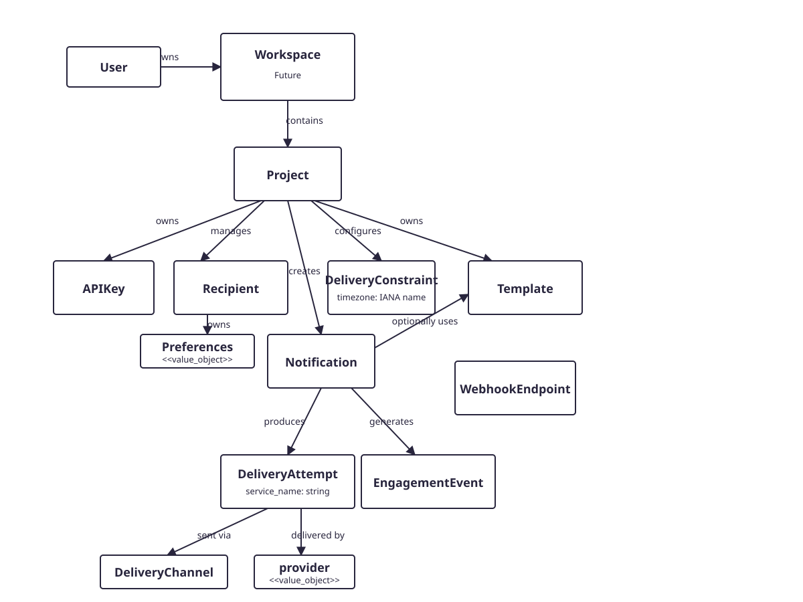

# Domain Model

## Purpose

This diagram models the core business concepts within Tiber and the relationships between them. Unlike the C4 architecture diagrams, which describe the structure of the software system, the domain model focuses on the problem domain by identifying the entities Tiber manages, their responsibilities, and how they relate to one another.

The model provides a shared ubiquitous language for the project and serves as the conceptual foundation for the database schema, REST API resources, authorization model, and event contracts while remaining independent of implementation details.

## Diagram

## Core Concepts

- **Workspace _(Future)_:** Represents the highest tenancy boundary in Tiber, grouping one or more projects under a shared organization. Workspace support is planned for a future release; the current implementation uses Project as the effective tenancy boundary

- **Project:** Represents the primary tenancy boundary within Tiber. Every API key, template, recipient, notification, webhook endpoint, and delivery constraint belongs to exactly one project.

- **Account:** Represents the ownership root for projects. Tiber is a notification-delivery platform, not an authentication service, so the domain models accounts by identity alone: the Account entity carries an id and nothing else. Authentication data (credentials, email, verification, role) belongs to the supporting auth capability and is stored in infrastructure, accessed through application-layer ports — never through the domain model.

- **API Key:** Represents machine authentication for client applications submitting notification requests.

- **Template:** Defines reusable notification content that can be rendered before delivery. Notifications may either reference a template or provide content directly.

- **Recipient:** Represents the intended destination of a notification. A recipient encapsulates channel-specific addressing information such as email addresses or push notification tokens, plus static profile facts (`timezone`, `language`) that the client sets once and updates when they change (doc 08, D1). Facts are nullable — `None` means unknown, never a fabricated default — and ownerless auto-created profiles ship bare. The ML layer reads these as its cold-start feature set (doc 05); the delivery policy chain consults them only for recipient-level restriction evaluation (below).

- **Preferences:** A value object that represents user-configured consent preferences controlling what messages a recipient receives and through which channels. Frequency-based controls are out of scope until a scheduling layer exists.

- **Notification:** Represents a request accepted by Tiber to deliver a message to a recipient. A notification is immutable once accepted and progresses through scheduling, delivery, retries, and completion. The client-supplied `context` field is retired (doc 08, D5): static recipient facts live on the Recipient profile, learned behavior comes from engagement events, and no per-send feature payload exists. `group_key` is the optional, opaque client-supplied identity of "the same logical thing" — the collapse unit for digest assembly and the join key for per-entity learning (doc 08, D6). Cancellation reasons are optional for clients and mandatory for system-initiated cancellations (doc 08, D7).

- **Delivery Attempt:** Represents a single attempt to deliver a notification through an external delivery service identified by name. A notification may produce multiple delivery attempts as a result of retries or service failures. An attempt records only what happened when a provider was contacted: `success` or `fail`. Policy decisions happen before any provider contact and therefore never appear on attempts — they live on the notification's lifecycle.

- **Engagement Event:** Represents recipient interactions that occur after delivery.

- **Delivery Channel:** Represents the communication medium used to deliver a notification, such as email, SMS, push notification, or webhook.

- **Webhook Endpoint:** Represents an outbound callback destination registered by a project to receive notification lifecycle events.

- **Delivery Constraint:** Represents project-level rules governing when notifications may be delivered: blackout periods (absolute datetime-range prohibitions), quiet hours (recurring time-of-day prohibitions per channel), and the project's timezone (an IANA name). The two kinds differ fundamentally in time semantics: a blackout is an absolute window in time — an instant is inside or outside it identically in every timezone, so no projection is performed; quiet hours are wall-clock rules evaluated by projecting the send instant into the project's configured zone. Recipient-level restrictions (a personal quiet-hours window and blackout period on Preferences) are evaluated the same way on the recipient's own profile timezone.

## Policy Consequences

Policy evaluation is domain logic, and each rule declares the business consequence of its violation. The domain owns this mapping; the application layer maps the consequence onto the notification's state machine without inspecting rule names.

- **SUPPRESS** — a permanent, intentional drop. The notification is persisted with a `suppression_reason` and never delivered. Applies to: recipient opt-outs (channel, category, topic), blackout periods, missing channel addresses, and recipient-level blackout periods.

- **POSTPONE** — a temporary deferral. The notification is persisted and re-queued for delivery after the restrictive window closes: `resume_at` is computed by the domain as the next window end (project timezone for project quiet hours, the recipient's profile timezone for recipient quiet hours) plus a small grace margin. While postponed, the notification carries `POSTPONED` with `send_at` set to the resume time; when the resume time passes, the worker resumes it to `PENDING` and delivery proceeds normally. Applies to: quiet-hours windows (project and recipient level).

**CRITICAL notifications bypass the entire policy chain.** The bypass is uniform: a CRITICAL dispatch can never be rejected by one rule but not another. The recipient's need to receive the message (fraud alert, MFA token) outranks consent and configured silence.

## Aggregate Boundaries

The following aggregate boundaries define the ownership of the primary business entities within Tiber.

### Account Aggregate

The Account aggregate is the account-level root for ownership and owns:

- Projects

The account's access context (credentials, sessions, roles) is deliberately NOT part of the domain aggregate — it is the supporting auth capability, stored in infrastructure.

### Project Aggregate

The Project aggregate is the root of tenant isolation and owns:

- API Keys
- Templates
- Recipients
- Webhook Endpoints
- Delivery Constraints

### Notification Aggregate

The Notification aggregate owns:

- Notification
- Delivery Attempts

Each delivery attempt represents an immutable record of a single delivery execution.

### Recipient Aggregate

The Recipient aggregate owns:

- Preferences

## Key Decisions

- **Project is the tenancy boundary:** All persistent resources belong to exactly one project. Project ownership is enforced throughout the platform to ensure tenant isolation.

- **Accounts are ownership roots, not identities:** An account owns and manages one or more projects, while machine clients authenticate through API keys. The domain does not model authentication: Tiber is not an authentication service, so auth data lives outside the domain model.

- **Notifications are immutable:** After a notification has been accepted, its content is never modified. Retries generate additional delivery attempts rather than altering the original notification.

- **Engagement events are modeled separately from delivery attempts:** Delivery attempts and engagement events represent different stages of the notification lifecycle and therefore are modeled as separate domain concepts. A Delivery Attempt records the platform's attempt to send a notification through a delivery provider and captures operational outcomes such as success, failure, retries, and provider responses. An Engagement Event records recipient interactions that occur after delivery, such as opens, clicks, bounces, unsubscribes, or push notification taps.

- **Delivery history is modelled separately:** Delivery attempts are distinct from notifications to preserve a complete history of retries, failures, provider responses, and delivery outcomes.

- **Templates are optional:** Notifications may either reference a reusable template or contain fully rendered content supplied by the client application.

- **Delivery channel and service name are separate values:** A delivery channel represents how a notification is sent (Email, SMS, Push), while each delivery attempt records the external service name as a string. Adapters can be replaced or added without introducing a persisted service entity.

### BlackoutPeriod vs QuietHours

BlackoutPeriod is an absolute datetime range: it is checked once per send against the send instant and expires naturally when the range passes. QuietHours is a recurring time-of-day window that is constantly checked until removed — the archetypal "do not disturb" configuration. A one-time hour-based quiet window can be expressed as a BlackoutPeriod because its boundaries are datetimes.

The consequence difference follows the semantics: a blackout violates the sender's own declared rule (suppress — never deliver), while quiet hours merely defer delivery to a more appropriate time (postpone — deliver after the window).

## What this diagram does not show

This domain model intentionally omits implementation details including:

- database tables
- foreign keys
- SQLAlchemy models
- indexes and constraints
- queue payloads
- REST endpoints
- authentication mechanisms
- caching
- service boundaries
- machine learning components
- infrastructure concerns
