# RabbitMQ Topology

## Purpose

This diagram describes how RabbitMQ is used within Tiber to transport notification delivery jobs between the API Service and the Worker Service.
It illustrates the messaging topology, including exchanges, queues, routing keys, retry queues, dead-letter queues, and the flow of messages through the delivery lifecycle. The diagram demonstrates how Tiber achieves reliable asynchronous processing while isolating delivery channels and separating business scheduling from operational retry handling.

## Diagram

## Routing Strategy

Tiber uses a single topic exchange named `notifications.exchange` to route notification jobs based on their delivery channel.

Each notification is published with a routing key representing the target channel.

| Routing Key             | Destination Queue        |
| ----------------------- | ------------------------ |
| `notification.email`    | `email.delivery.queue`   |
| `notification.push`     | `push.delivery.queue`    |
| `notification.sms`      | `sms.delivery.queue`     |
| `notification.webhook`  | `webhook.delivery.queue` |
| `notification.in_app`   | `in_app.delivery.queue`  |

This routing strategy allows additional notification channels to be introduced without modifying publishers.

## Queue Responsibilities

### Delivery Queues

Delivery queues receive notification jobs that are ready for processing by the Worker Service.

Each delivery channel owns its own queue to isolate provider failures and prevent one channel from blocking another.

Examples include:

- `email.delivery.queue`
- `push.delivery.queue`
- `sms.delivery.queue`
- `webhook.delivery.queue`
- `in_app.delivery.queue`

### Retry Queues

Retry queues temporarily hold failed delivery attempts before they are reprocessed.

Messages remain in the retry queue for a configured delay using a queue-level Time-To-Live (TTL). Once the delay expires, RabbitMQ automatically routes the message back to its original delivery queue using dead-letter routing.

This mechanism implements exponential backoff without blocking worker processes.

### Dead-Letter Queues

When a notification exhausts its configured retry limit, it is routed to a channel-specific dead-letter queue (DLQ).

Dead-letter queues preserve failed jobs for inspection, debugging, replay, or operational intervention.

Examples include:

- `email.dlq`
- `push.dlq`
- `sms.dlq`
- `webhook.dlq`
- `in_app.dlq`

## Key Decisions

- **Topic exchange for channel routing:** A single topic exchange routes notification jobs according to their delivery channel. This keeps publishers independent of queue names while allowing new notification channels to be introduced with minimal configuration changes.

- **Queue isolation by delivery channel:** Each notification channel owns an independent delivery queue. This prevents failures or traffic spikes affecting one provider from impacting unrelated notification channels.

- **Publisher confirms:** The API Service publishes notification jobs using RabbitMQ Publisher Confirms. A notification request is only considered successfully queued after RabbitMQ acknowledges durable acceptance of the published message. This prevents silent message loss between the API Service and the broker.

- **Thin message payload:** Notification jobs carry a self-contained payload containing stable delivery information such as recipient, rendered content, scheduling metadata, ML prediction metadata, and retry state. The Worker Service only retrieves information that may legitimately change between enqueue and delivery, such as delivery policies or user preferences. This minimizes database access while ensuring policy decisions remain current at dispatch time.

- **Business scheduling is separate from messaging:** RabbitMQ is responsible only for transporting notification jobs. Business scheduling decisions, such as delayed delivery requested by the client or ML-recommended send times, are made before publication and carried in the job payload as scheduling metadata. The Worker Service's Scheduler Executor uses that metadata to route immediate jobs or hold deferred jobs until their scheduled time. RabbitMQ retry queues are used exclusively for operational retry delays following delivery failures. This separation ensures business scheduling logic remains independent of messaging infrastructure.

- **Broker-managed retry delays:** Retry delays are implemented using RabbitMQ retry queues rather than sleeping or delaying worker processes. Once the configured delay expires, RabbitMQ automatically returns the message to its original delivery queue for another delivery attempt. This keeps worker processes available to process new jobs while the broker manages retry timing.

- **Dead-letter queues preserve failed deliveries:** Notifications that exceed the configured retry limit are never discarded. Instead, they are routed to channel-specific dead-letter queues, allowing operators to inspect, replay, or permanently archive failed deliveries.

## What this diagram does not show

This topology diagram intentionally omits implementation details including:

- Celery worker internals
- queue payload schema
- notification processing pipeline
- provider-specific delivery logic
- webhook delivery workflow
- retry algorithms
- ML inference
- AI enhancement
- database persistence
- monitoring and observability configuration
